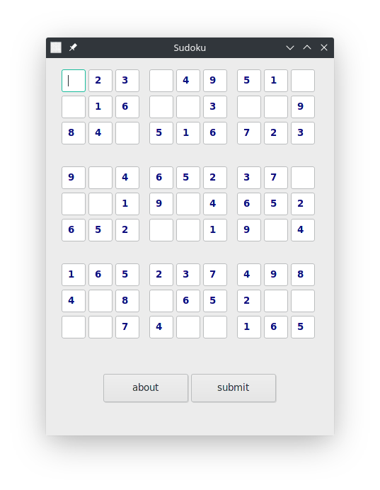

# sudoku

# description

A simple sudoku game made with nim lang using the Nigui GUI libary.
To win a game of sudoku simply guess the numbers that goes in the empty slots,
the numbers guessed must not appear more than once in the same row, column and
box. Now using this rule fill all empty slots and have fun playing Sudoku.
